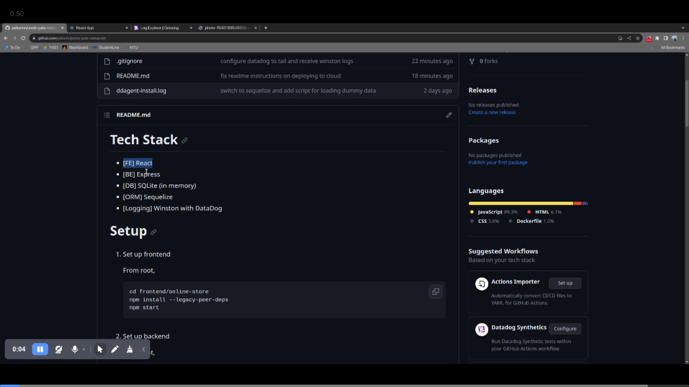

# Video Demo
# [](https://www.awesomescreenshot.com/video/20945280?key=2c2212eb5f5cb4f3d3503e886a4da82e)

# Tech Stack

- [FE] React
- [BE] Express
- [DB] SQLite (in memory)
- [ORM] Sequelize
- [Logging] Winston with DataDog

# Setup

1. Set up frontend

   From root,

   ```
   cd frontend/online-store
   npm install --legacy-peer-deps
   npm start
   ```

2. Set up backend

   From root,

   ```
   cd backend
   npm install --legacy-peer-deps
   npm start
   ```

3. Set up SQLite DB
   From root,

   ```
   cd backend
   node db.js
   ```

4. Load dummy data into DB
   ```
   node loadDummyData.js
   ```

# How to deploy this app on a cloud environment (Bonus: How you would do this with serverless components)


- [FE] React --> Cloud Run

  Create a Dockerfile

  ```
  FROM node:14.21.3

  WORKDIR /frontend/snippet-sharing-service

  COPY package.json .
  RUN npm install --legacy-peer-deps
  COPY . .
  EXPOSE 3000

  CMD ["npm", "start"]
  ```

  From root,

  ```
  cd frontend/online-store
  docker build -t online-store-fe-image .
  gcloud run deploy online-store-fe-image --source . --region=asia-southeast1 --port=3000
  ```

- [BE] Express --> Cloud Run

  Create a Dockerfile

  ```
  FROM node:14.21.3

  WORKDIR /backend

  COPY package.json .
  RUN npm install --legacy-peer-deps
  COPY . .
  EXPOSE 8000

  CMD ["npm", "start"]
  ```

  From root,

  ```
  cd backend
  docker build -t online-store-be-image .
  gcloud run deploy online-store-be-image --source . --region=asia-southeast1 --port=8000 --add-cloudsql-instances YOUR_INSTANCE_CONNECTION_NAME --set-env-vars INSTANCE_UNIX_SOCKET="/cloudsql/YOUR_INSTANCE_CONNECTION_NAME" --set-env-vars INSTANCE_CONNECTION_NAME=YOUR_INSTANCE_CONNECTION_NAME --set-env-vars DB_NAME=YOUR_DB_NAME --set-env-vars DB_USER=YOUR_DB_USER
  ```

- [DB] SQLite (in memory) --> Cloud SQL MySQL

  Set up Cloud SQL MySQL instance

  1.  Follow the tutorial [here](https://cloud.google.com/sql/docs/mysql/create-instance#:~:text=request%20an%20increase.-,Create%20a%20MySQL%20instance,-Console) to create a Cloud SQL instance. In this POC, we don't set a password (though it's good practice to)
  2.  Create a database `itemsDb`, then a table `items` inside this database - you can do this via Cloud Shell

  ```
  CREATE DATABASE itemsDb;
  USE items;
  CREATE TABLE items (
      id TEXT NOT NULL PRIMARY KEY,
      name TEXT NOT NULL,
      description TEXT,
      price REAL NOT NULL,
      imageUrl TEXT,
      createdAt DATETIME DEFAULT CURRENT_TIMESTAMP,
      updatedAt DATETIME DEFAULT CURRENT_TIMESTAMP
  );
  ```

  3.  Create a service account and place your service account key JSON in the project root. Then from root, run

  ```
  ./cloud_sql_proxy -instances=YOUR_INSTANCE_CONNECTION_NAME -credential_file=../YOUR_SERVICE_ACCOUNT_KEY.json
  ```

  This will allow you to connect to your Cloud SQL instance via the Cloud SQL Auth proxy, as if it were a local database

  Replace YOUR_INSTANCE_CONNECTION_NAME and YOUR_SERVICE_ACCOUNT_KEY

  Example: `./cloud_sql_proxy -instances=tap-2023:asia-southeast1:sss-mysql=tcp:3306 -credential_file=../tap-2023-653687ae417e.json`

- [Logging] Winston with DataDog --> Winston with Cloud Logging
  - Requires application level code change (winston config)
  - Can use BigQuery as sink for analytics

# Security hardening techniques on a cloud environment

## App Level

- Input validation - sanitize inputs in backend to prevent SQL injection, XSS, etc.
- Use Content Security Policy (CSP) - implement CSP headers to prevent XSS attacks on React frontend
- Secure Secrets Management - use GCP Secret Manager to manage API keys, database credentials, etc.

## Networking

- Private VPCs to control the IP address range, subnets, and configuration of route tables
  - Eg. Db should not be directly exposed to the public internet, put it in a private subnet
- Firewalls to create rules that allow/deny traffic to VMs, containers, and other resources

## IAM

- Enforce MFA for all IAM users
- Principal of least privilege, and use service accounts to deploy resources
- Regularly rotate and manage the lifecycle of service account keys
- Limit who and what can access resources, and regularly review permissions

## Native Cloud Security Services

- Google Cloud Armor, Cloud Security Command Center, and Cloud Security Scanner can help provide additional layers of security

# Implementation Details and Justification

## Using UUID for URL Identifier for Snippets

Security - doesn't give any info about the number of records in the db, unlike auto-incrementing integers
